# Claude 可用性网络配置：机场 + 静态住宅 IP 链式代理

用普通机场节点访问 Claude，大概率会撞上这个：

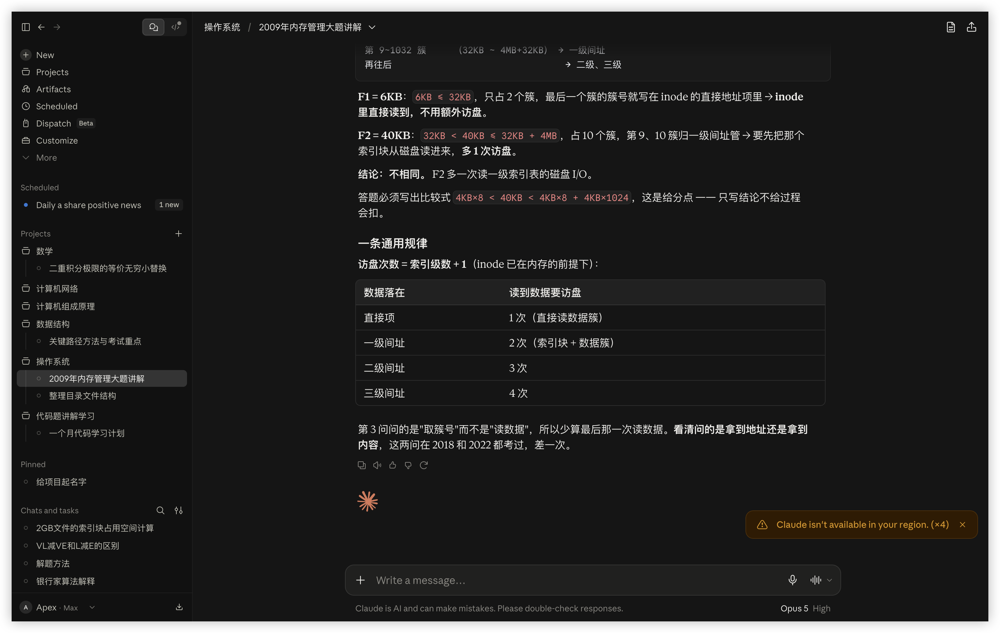

机场节点是机房 IP（数据中心 ASN），被风控标记的概率极高。换节点、换机场通常没用，因为问题出在 IP 类型上，不在线路快慢上。

这份教程记录的是能稳定用下来的方案：**机场节点负责翻墙出国，静态住宅 IP 负责最后一跳出口**，两者用 Clash Verge 的链式代理串起来。

## 方案原理

```
本机 → 机场节点（香港/日本，负责穿透 GFW）→ 静态住宅 SOCKS5（美国，负责作为真实出口 IP）→ Claude
   入口                                      出口
```

为什么不能只用住宅 IP：IPFoxy 这类代理商给的是裸 SOCKS5，从国内直连基本不通（你会看到 `Timeout`）。所以必须先用机场节点出去，再从境外接入住宅代理。

为什么不能只用机场：机房 IP 过不了 Claude 的风控。

代价说清楚：多一跳意味着延迟叠加。实测入口香港节点 136ms，串上美国住宅出口后整条链 338ms。日常对话够用，但比单跳明显慢，这是这个方案的固定成本。

## 前置条件

- Clash Verge Rev（支持链式代理的版本，普通 Clash 客户端没有这个功能）
- 一个能用的机场订阅
- 一个静态住宅 IP（本文用 IPFoxy，约 $12/月/IP）

机场先配好，确认能正常上网：

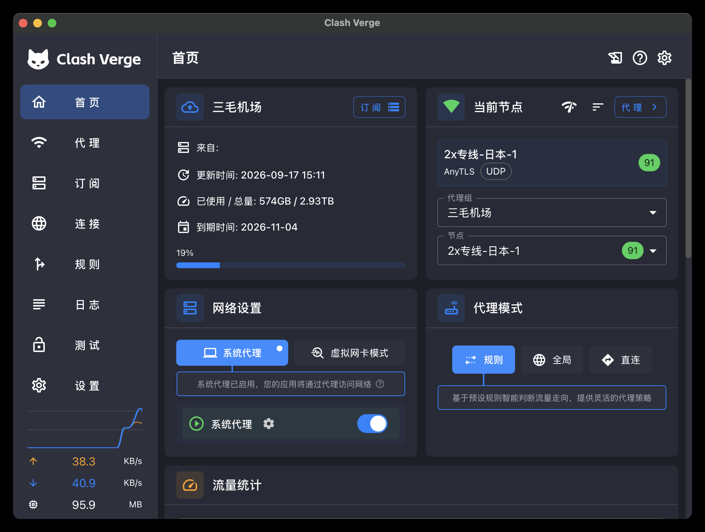

## 第一步：买静态住宅 IP

访问 [IPFoxy](https://www.ipfoxy.net/)，注册后进购买页。

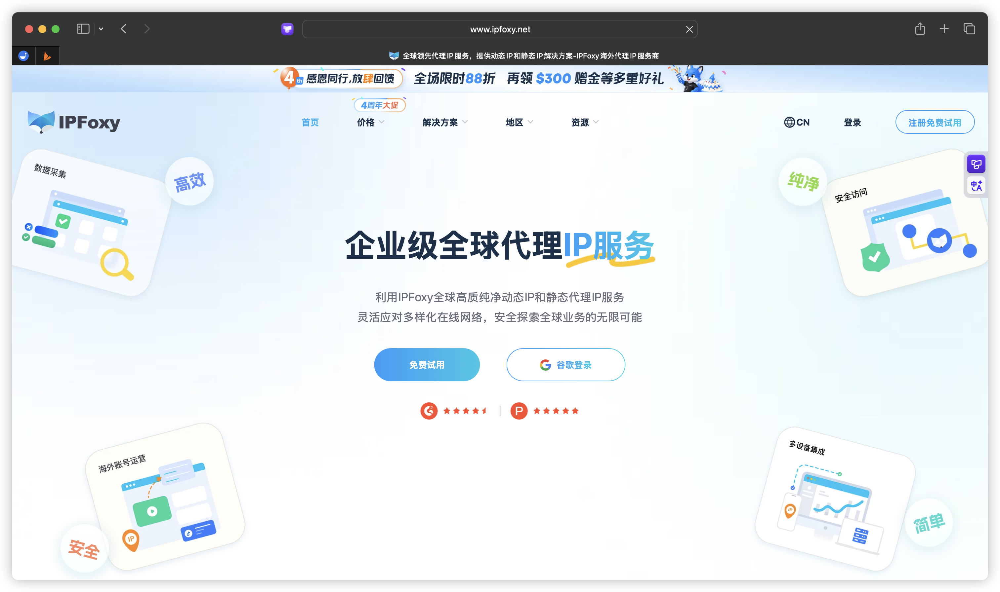

购买时的选项按下面这套配：

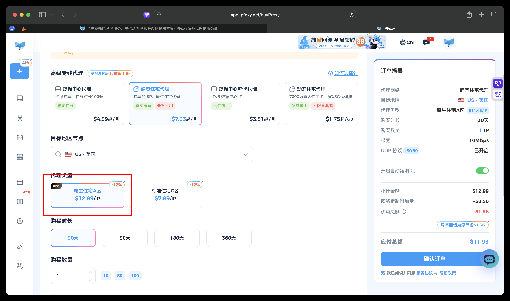

| 选项 | 选什么 | 原因 |
| --- | --- | --- |
| 代理网络 | 静态住宅代理 | 动态住宅每次请求换 IP，会触发 Claude 的异地登录风控 |
| 目标地区 | US - 美国 | Claude 主力服务区 |
| 代理类型 | 原生住宅 A 区（$12.99/IP） | 标准住宅 C 区便宜 5 刀，但被复用过的概率更高，容易开局就是脏 IP |
| 购买时长 | 30 天 | 先跑通再考虑年付 |
| UDP 协议 | 开启（+$0.50） | 不开的话部分场景会有问题，五毛钱别省 |

买完在后台能拿到一组凭据：`IP:端口:用户名:密码`。

> 别开自动续期，除非你确定长期用。默认是开的。

## 第二步：把住宅 IP 加进 Clash

订阅页里右键你的机场订阅，选「编辑节点」：

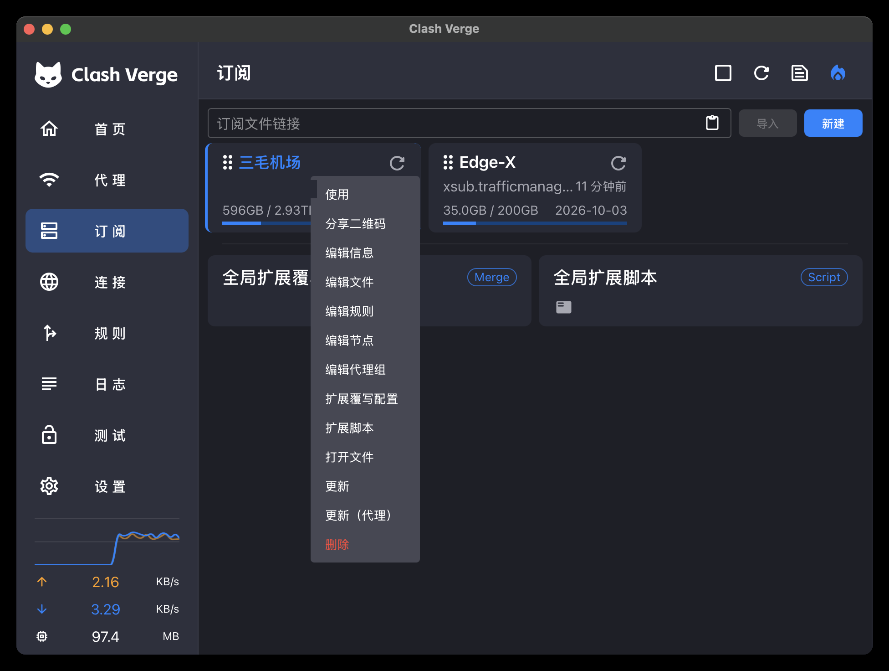

左边的输入框里粘贴 SOCKS5 URI，格式是：

```
socks5://用户名:密码@IP:端口#随便起个名字
```

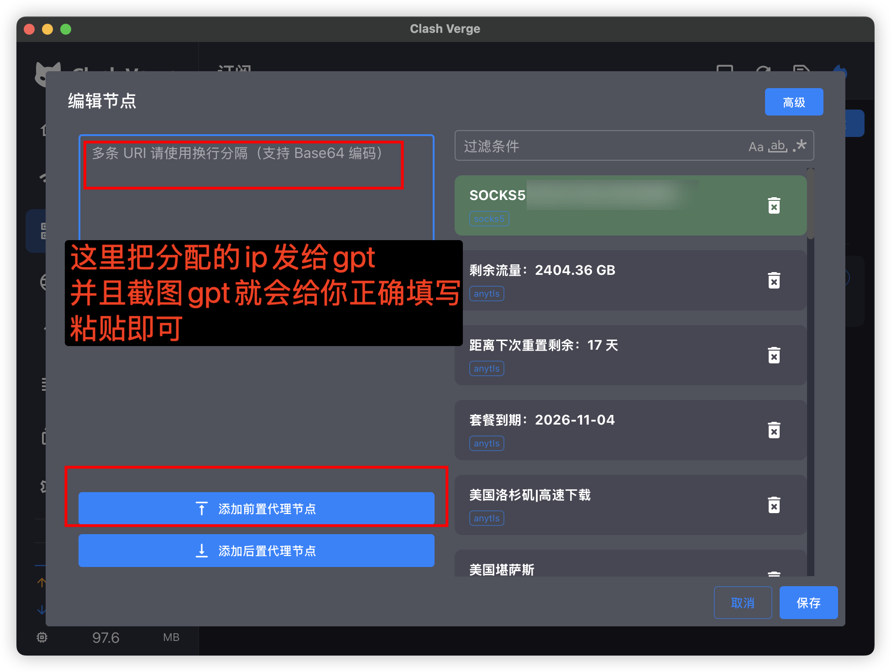

如果 IPFoxy 给你的是 `1.2.3.4:8080:user:pass` 这种冒号分隔的串，手动拼成上面的 URI 就行；懒得拼的话把那串丢给任意 AI 让它转成 socks5 URI 格式，一样的结果。

粘完 URI 之后，**必须点一下左下角的「添加前置代理节点」**，然后选一个机场节点（香港/日本都行）。

这一步是整套配置的核心。前置代理对应配置里的 `dialer-proxy` 字段，意思是「访问这个 SOCKS5 节点时，先走哪条线路」。不设的话，Clash 会从你本机直连美国的住宅 IP —— 国内直连裸 SOCKS5 根本不通，节点等于废的。设上之后流量才变成 `本机 → 机场 → 住宅 IP`。

保存后回到代理组，新节点会出现在列表最上面：

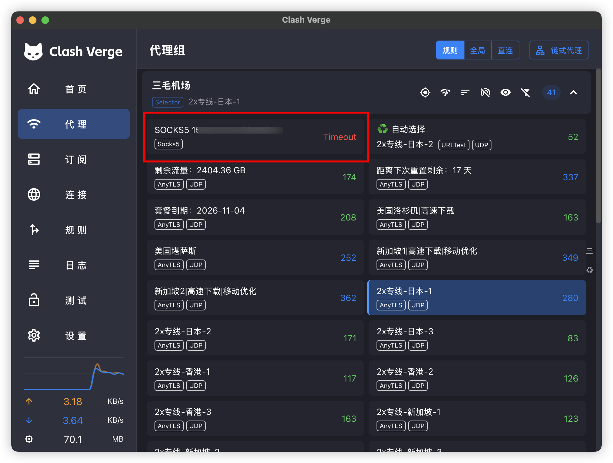

**这里显示 `Timeout` 是正常的，不是配错了。** 延迟测试是从本机直连测的，国内直连裸 SOCKS5 本来就不通。它只有在链式代理里当出口才会通。

## 第三步：在链式代理里连接

前置代理设完还不能直接用，两步都要做：前置代理解决的是「这个住宅节点怎么被访问到」，链式代理负责把这条链挂成当前实际生效的线路。少任何一步都连不上。

代理页右上角点「链式代理」，进入链式代理模式。

按顺序点两个节点，顺序不能反：

1. 先点机场节点（比如 2x专线-香港-1）→ 它进入「入口」位
2. 再点刚加的 SOCKS5 节点 → 它进入「出口」位

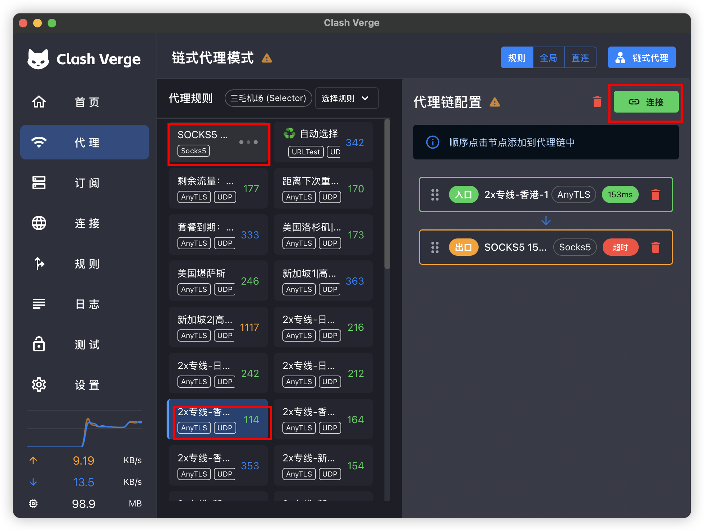

确认链路是 `入口: 机场节点 → 出口: SOCKS5` 之后，点右上角绿色的「连接」。

连接成功后，出口节点的 `超时` 会变成实际延迟：

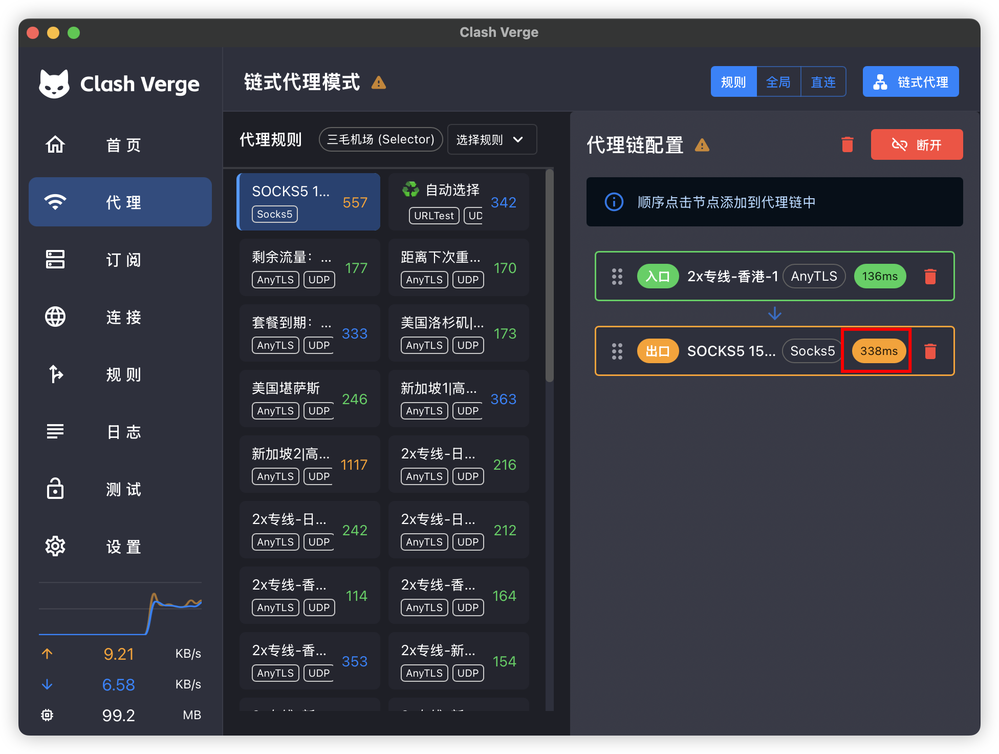

出口显示出数字（图里是 338ms）就是通了。这时候刷新 Claude 页面，区域限制提示应该消失。

## 常见问题

**出口一直是「超时」，连不上**

按这个顺序排查：

1. 回「编辑节点」确认前置代理是不是漏点了——这是最常见的原因，URI 粘对了但没设前置代理，节点永远连不上（注意前置代理和链式代理是两步，都得做）
2. 把入口的机场节点单独设为当前节点，确认它本身能上网
3. 检查 SOCKS5 URI 里的用户名密码有没有多余空格（复制粘贴常带上）
4. 去 IPFoxy 后台确认 IP 还在有效期内，以及有没有绑定 IP 白名单——如果开了白名单认证，你要填的是机场节点的出口 IP，不是你家宽带 IP，这一点很容易搞错

**连通了但 Claude 还是提示区域限制**

大概率是买到了脏 IP（之前被人用来做过批量注册之类）。找 IPFoxy 客服换一个，正常都给换。换完记得同步改 Clash 里的 URI。

**能用几天后又被封**

同一个住宅 IP 上不要同时登多个 Claude 账号，也不要和其他需要高频请求的工具共用这条出口。

**延迟太高不想忍**

入口节点换成日本或者新加坡试试，不同机场的对美路由差别很大。出口地区也可以从美国换成其他 Claude 支持的地区，但美国 IP 池最大、最容易换到干净的。

## 成本

每月约 $13（IPFoxy 静态住宅 $12.99 + UDP $0.50，按 88 折实付 $11.93），机场另算。

---

方案不复杂，卡人的地方就三个：一是漏点「添加前置代理节点」；二是不知道 `Timeout` 是正常现象，反复删了重配；三是入口出口点反了。避开这两个坑基本一次就能通。

## 补充链式代理脚本(一段JS代码，更加方便进行配置！)

上面第二、三步是在图形界面里手动点的：加节点、设前置代理、进链式代理模式选入口和出口。手动方式的好处是所见即所得，缺点是**不持久**——机场订阅一更新，配置重新生成，手动加进去的节点和分组就没了，每次都得从头点一遍。

Clash Verge 的「全局扩展脚本」解决的就是这个问题。它是一个 JS 脚本，每次生成配置时都会执行一遍 `main(config)`：你可以在里面往 `config.proxies` 里插入静态 IP 节点、重建代理分组、改写分流规则。把链式代理写进脚本之后，订阅怎么更新都不影响，日常只需要维护四个字段。

> 脚本方式和手动方式选一种就行，别同时用——两套都做的话，代理组里会出现两个同名的静态 IP 节点。

### 一、编辑全局扩展脚本

在 Clash Verge 的「订阅」界面中，找到「全局扩展脚本」这一项，**双击**它打开脚本编辑器：

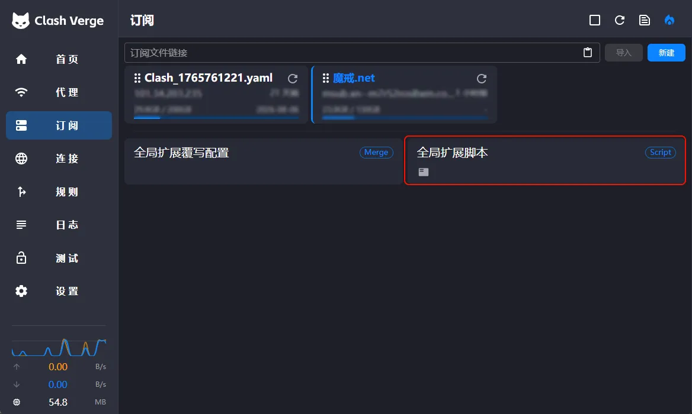

注意别点错左边那个：「全局扩展覆写配置」（带 `Merge` 标签）是给 YAML 合并用的，右边带 `Script` 标签的「全局扩展脚本」才是 JS 脚本。

### 二、添加链式代理脚本

将下面的脚本代码粘贴到编辑器中：

```javascript
function main(config) {
  // ================== 核心配置区域 ==================
  const staticProxyConfig = {
    name: "🔒 静态IP (出口)",
    server: "你的静态IP地址",
    port: 8080,
    username: "你的用户名",
    password: "你的密码",
    type: "socks5",
    udp: true,
  };

  const groupAirportName = "✈️ 机场中转池";
  const groupFinalName = "🚀 最终出口选择";
  // =================================================

  // 1. 提取机场节点
  const allProxies = config.proxies.map(p => p.name);

  // 2. 添加静态IP (链式指向机场池)
  staticProxyConfig["dialer-proxy"] = groupAirportName;
  config.proxies.push(staticProxyConfig);

  // 3. 重置分组 (只保留两个核心分组)
  config["proxy-groups"] = [
    {
      name: groupAirportName,
      type: "select",
      proxies: allProxies,
    },
    {
      name: groupFinalName,
      type: "select",
      proxies: [staticProxyConfig.name, groupAirportName],
    },
  ];

  // 4. 兜底规则：未匹配的流量走最终出口选择
  config.rules = (config.rules || []).filter(r => !/^MATCH/i.test(r));
  config.rules.push(`MATCH,${groupFinalName}`);

  return config;
}
```

然后根据你购买的静态 IP 信息，修改「核心配置区域」的四个字段：

| 字段 | 填什么 | 说明 |
| --- | --- | --- |
| `server` | 静态 IP 的地址 | IPFoxy 后台给的那个 IP |
| `port` | 静态 IP 的端口 | 和 IP 一起给的端口号 |
| `username` | 代理用户名 | 复制时注意别带多余空格 |
| `password` | 代理密码 | 同上 |

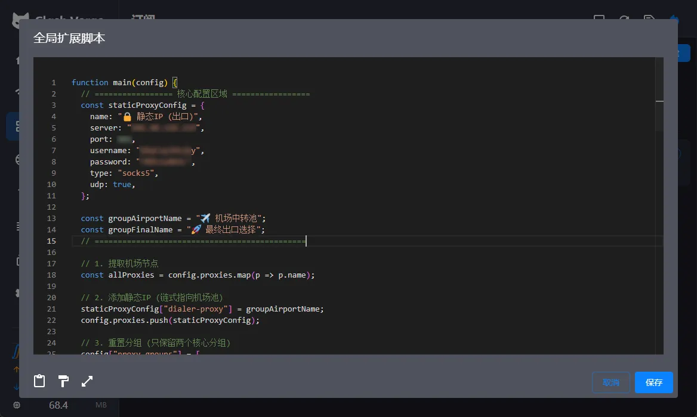

其余部分一般不用动，几个关键点：

- `type: "socks5"` 保持不变，IPFoxy 给的就是 SOCKS5 代理
- `udp: true` 对应购买时勾选的 UDP 协议，别关掉
- `name` 是节点显示名，可以改；但改了之后分组里的引用也要一起改，建议保持默认
- `dialer-proxy` 不用手填，脚本会把它设成「✈️ 机场中转池」，这就是自动版的前置代理——静态 IP 节点永远先经由机场节点访问

### 三、保存配置

点击编辑器右下角的「保存」按钮（位置见上图右下角的蓝色按钮），配置就写入完成了。

保存之后脚本会在下一次生成配置时生效，代理页和首页会自动出现对应的分组与节点。

### 四、验证配置效果

#### 1. 查看新的代理分组

切换到「代理」标签页，应该能看到两个新的代理组：

- **✈️ 机场中转池**：装着订阅里的全部机场节点，用来当入口
- **🚀 最终出口选择**：装着「🔒 静态IP (出口)」和「✈️ 机场中转池」两个选项，决定流量最终怎么出去

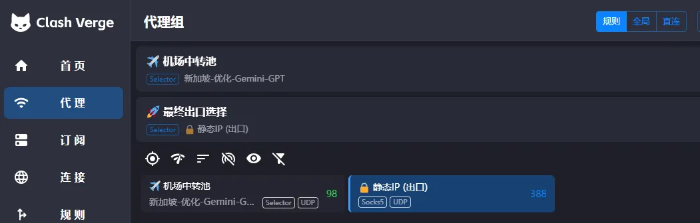

#### 2. 使用静态 IP 出口

在「🚀 最终出口选择」中选择「🔒 静态IP (出口)」，流量将按照以下路径转发：

```
本机 → ✈️ 机场中转池（选中的那个机场节点）→ 🔒 静态IP (出口) → Claude
   入口                                    出口
```

「首页」的「当前节点」卡片同样能看到当前生效的组合，节点右侧的延迟数字就是整条链路的实际延迟（图里是 388ms）：

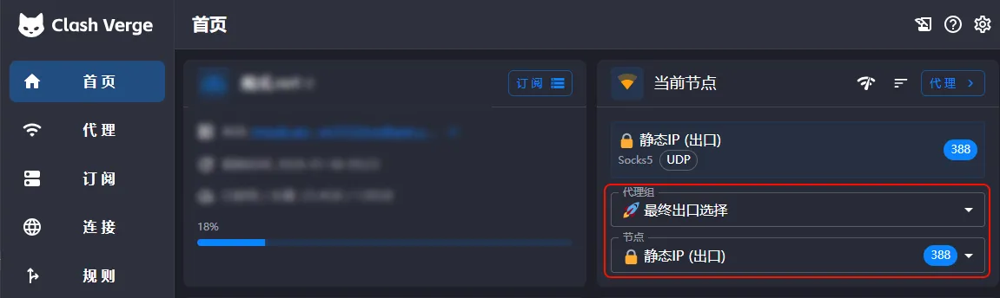

#### 3. 验证 IP 地址

访问 IPPure 或 Ping0 检测当前 IP 地址：

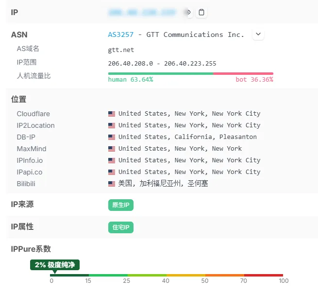

如果显示的是你购买的静态 IP 地址，并且 IP 属性标注为「住宅IP」、IP 来源为「原生IP」，说明配置成功。

你也可以在 Clash Verge 的「日志」页面确认流量确实走了这条出口——每一条连接后面都会跟上 `using 🚀最终出口选择[🔒 静态IP (出口)]`：

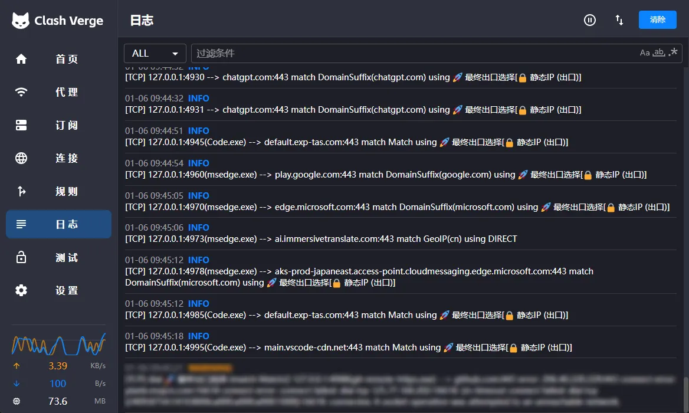

#### 4. 切换回机场直连模式

如需直接使用机场节点（不经过静态 IP），在「🚀 最终出口选择」中选择「✈️ 机场中转池」，然后在「✈️ 机场中转池」中选择具体的节点即可：

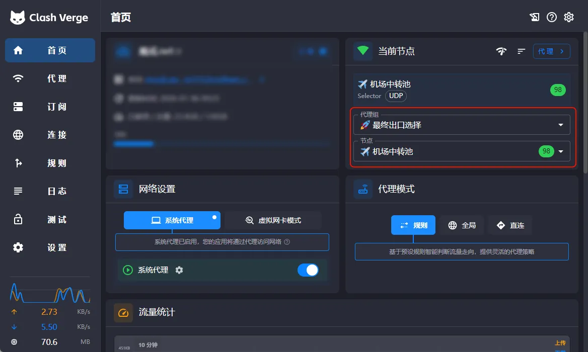

图里最终出口落在「✈️ 机场中转池」上，延迟回到了 98ms 的机场节点水平。想再用回住宅 IP，把「🚀 最终出口选择」切回「🔒 静态IP (出口)」就行，两边随时切换，不用重新配置。

